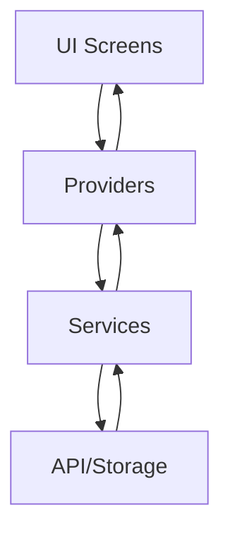

# 🔧 Guide Technique - QCM App

Guide technique détaillé pour les développeurs travaillant sur l'application QCM.

## 🏗️ Architecture Technique

### Pattern Architectural
L'application utilise le **Provider Pattern** pour la gestion d'état avec une architecture en couches :

```
Presentation Layer (UI)
    ↓
Business Logic Layer (Providers)
    ↓
Service Layer (Services)
    ↓
Data Layer (API + Local Storage)
```

### Flux de Données



## 📁 Structure Détaillée des Fichiers

### Models (`lib/models/`)

#### `question.dart`
```dart
class Question {
  final String id;
  final String question;
  final String correctAnswer;
  final List<String> incorrectAnswers;
  final List<String> _shuffledAnswers; // Cache des réponses mélangées
  
  // Getter qui retourne les réponses mélangées (fixe le bug de re-shuffle)
  List<String> get allAnswers => _shuffledAnswers;
}
```

#### `quiz_result.dart`
```dart
class QuizResult {
  final List<Question> questions;
  final List<String> userAnswers;
  final int score;
  final DateTime dateTime;
  final String category;
  final String difficulty;
}
```

### Providers (`lib/providers/`)

#### `quiz_provider.dart` - Logique Métier du Quiz
```dart
class QuizProvider extends ChangeNotifier {
  // État
  QuizStatus _status = QuizStatus.initial;
  List<Question> _questions = [];
  int _currentQuestionIndex = 0;
  int _score = 0;
  Timer? _timer;
  int _timeLeft = AppConstants.questionTimeSeconds;
  
  // Méthodes principales
  Future<void> startQuiz(QuizOptions options);
  void answerQuestion(String answer);
  void _completeQuiz();
  void resetQuiz();
}
```

#### `settings_provider.dart` - Paramètres Utilisateur
```dart
class SettingsProvider extends ChangeNotifier {
  // Paramètres
  bool _isDarkMode = false;
  String _language = 'fr';
  bool _soundEnabled = true;
  bool _vibrationEnabled = true;
  bool _notificationsEnabled = true;
  
  // Persistance automatique
  void _saveSettings() async {
    await _storageService.saveSettings(/* ... */);
  }
}
```

### Services (`lib/services/`)

#### `api_service.dart` - Communication API
```dart
class ApiService {
  static const String _baseUrl = 'https://opentdb.com/api.php';
  
  // Récupération des catégories
  Future<List<Category>> getCategories();
  
  // Récupération des questions
  Future<List<Question>> getQuestions(QuizOptions options);
  
  // Simulation de nouveaux contenus
  Future<void> checkForNewContent();
}
```

#### `notification_service.dart` - Gestion des Notifications
```dart
class NotificationService {
  // Types de notifications
  Future<void> playCorrectSound();           // Rappels quotidiens (19h)
  Future<void> _scheduleMotivationalNotifications(); // Motivation aléatoire
  Future<void> showNewQuizNotification();    // Nouveaux contenus
  Future<void> showCongratulationsNotification(); // Félicitations
  
  // Gestion
  Future<void> scheduleDefaultNotifications();
  Future<void> cancelAllNotifications();
}
```

#### `background_service.dart` - Tâches en Arrière-Plan
```dart
class BackgroundService {
  Timer? _contentCheckTimer;
  
  // Démarre les services périodiques
  Future<void> start() async {
    await _notificationService.scheduleDefaultNotifications();
    _startContentCheck(); // Vérifie toutes les 6h
  }
  
  // Vérification de nouveaux contenus
  void _startContentCheck() {
    _contentCheckTimer = Timer.periodic(
      const Duration(hours: 6),
      (timer) async => await _checkForNewContent(),
    );
  }
}
```

## 🔄 Flux de Fonctionnement

### Démarrage de l'Application

1. **main.dart** initialise les services
```dart
main() async {
  // Services essentiels
  await VibrationService().init();
  await NotificationService().initialize();
  await BackgroundService().start();
  
  runApp(MyApp());
}
```

2. **MyApp** configure les providers
```dart
MultiProvider(
  providers: [
    ChangeNotifierProvider(create: (_) => QuizProvider()),
    ChangeNotifierProvider(create: (_) => SettingsProvider()),
  ],
  child: MaterialApp(/* ... */),
)
```

### Flux d'un Quiz

1. **Sélection** (`quiz_options_screen.dart`)
```dart
// L'utilisateur configure le quiz
QuizOptions options = QuizOptions(
  category: selectedCategory,
  difficulty: selectedDifficulty,
  amount: selectedAmount,
  type: selectedType,
);
```

2. **Démarrage** (`quiz_provider.dart`)
```dart
Future<void> startQuiz(QuizOptions options) async {
  _status = QuizStatus.loading;
  notifyListeners();
  
  // Récupération des questions via API
  _questions = await _apiService.getQuestions(options);
  
  _status = QuizStatus.inProgress;
  _startTimer();
  notifyListeners();
}
```

3. **Jeu** (`quiz_screen.dart`)
```dart
// Interface réactive aux changements du provider
Consumer<QuizProvider>(
  builder: (context, quizProvider, child) {
    return QuestionCard(
      question: quizProvider.currentQuestion,
      onAnswerSelected: quizProvider.answerQuestion,
    );
  },
)
```

4. **Completion** (`quiz_provider.dart`)
```dart
void _completeQuiz() {
  _status = QuizStatus.completed;
  _cancelTimer();
  
  // Sauvegarde du résultat
  _storageService.saveQuizResult(result);
  
  // Notification de félicitations
  _notificationService.showCongratulationsNotification(
    score: _score,
    totalQuestions: _questions.length,
  );
}
```

## 🔔 Système de Notifications Détaillé

### Architecture des Notifications

```
NotificationService (Singleton)
    ├── Rappels Quotidiens (Timer 19h)
    ├── Motivation (Random 9h-21h)
    ├── Nouveaux Contenus (BackgroundService)
    └── Félicitations (QuizProvider)
```

### Configuration Android

#### `android/app/build.gradle.kts`
```kotlin
android {
    compileOptions {
        isCoreLibraryDesugaringEnabled = true
    }
}

dependencies {
    coreLibraryDesugaring("com.android.tools:desugar_jdk_libs:2.0.4")
}
```

#### `android/app/src/main/AndroidManifest.xml`
```xml
<uses-permission android:name="android.permission.POST_NOTIFICATIONS"/>
<uses-permission android:name="android.permission.SCHEDULE_EXACT_ALARM"/>
<uses-permission android:name="android.permission.VIBRATE"/>

<receiver android:name="com.dexterous.flutterlocalnotifications.ScheduledNotificationReceiver" />
```

### Programmation des Notifications

#### Rappels Quotidiens
```dart
Future<void> _scheduleDailyReminders() async {
  for (int i = 0; i < 7; i++) {
    final scheduledDate = _nextInstanceOfTime(19, 0).add(Duration(days: i));
    
    await _flutterLocalNotificationsPlugin.zonedSchedule(
      100 + i, // ID unique
      'QCM App - Rappel quotidien',
      reminderMessages[i % reminderMessages.length],
      scheduledDate,
      notificationDetails,
      matchDateTimeComponents: DateTimeComponents.time,
    );
  }
}
```

#### Notifications Aléatoires
```dart
Future<void> _scheduleMotivationalNotifications() async {
  final random = Random();
  for (int i = 0; i < 5; i++) {
    final daysFromNow = random.nextInt(7) + 1;
    final hour = random.nextInt(12) + 9; // 9h-21h
    final minute = random.nextInt(60);
    
    final scheduledDate = DateTime.now()
        .add(Duration(days: daysFromNow))
        .copyWith(hour: hour, minute: minute);
    
    await _flutterLocalNotificationsPlugin.zonedSchedule(/* ... */);
  }
}
```

## 🎨 Système de Thèmes

### Configuration des Thèmes (`lib/utils/theme.dart`)

```dart
class AppTheme {
  static ThemeData lightTheme = ThemeData(
    useMaterial3: true,
    colorScheme: ColorScheme.fromSeed(
      seedColor: Colors.blue,
      brightness: Brightness.light,
    ),
    // Personnalisations...
  );
  
  static ThemeData darkTheme = ThemeData(
    useMaterial3: true,
    colorScheme: ColorScheme.fromSeed(
      seedColor: Colors.blue,
      brightness: Brightness.dark,
    ),
    // Personnalisations...
  );
}
```

### Utilisation Dynamique
```dart
// Dans MaterialApp
theme: AppTheme.lightTheme,
darkTheme: AppTheme.darkTheme,
themeMode: settingsProvider.isDarkMode 
    ? ThemeMode.dark 
    : ThemeMode.light,
```

## 🌍 Système de Localisation

### Structure (`lib/utils/localization.dart`)

```dart
class AppLocalizations {
  static final Map<String, Map<String, String>> _localizedValues = {
    'en': {
      'appName': 'QCM App',
      'startQuiz': 'Start Quiz',
      // ...
    },
    'fr': {
      'appName': 'QCM App',
      'startQuiz': 'Commencer le Quiz',
      // ...
    },
    'ar': {
      'appName': 'تطبيق QCM',
      'startQuiz': 'ابدأ الاختبار',
      // ...
    },
  };
  
  String get(String key) => _localizedValues[_locale]?[key] ?? key;
}
```

### Configuration RTL pour l'Arabe
```dart
// Dans MaterialApp
localizationsDelegates: [
  GlobalMaterialLocalizations.delegate,
  GlobalWidgetsLocalizations.delegate,
  GlobalCupertinoLocalizations.delegate,
],
supportedLocales: [
  Locale('en', ''),
  Locale('fr', ''),
  Locale('ar', ''),
],
```

## 🔊 Gestion Audio

### Service Audio (`lib/services/sound_service.dart`)

```dart
class SoundService {
  final AudioPlayer _audioPlayer = AudioPlayer();
  bool _soundsAvailable = false;
  
  // Vérification de disponibilité
  Future<void> _checkSoundAvailability() async {
    _soundsAvailable = true; // Assume disponible
  }
  
  // Lecture sécurisée
  Future<void> playClickSound() async {
    if (!_soundEnabled || !_soundsAvailable) return;
    
    try {
      await _audioPlayer.play(AssetSource('sounds/click.mp3'));
    } catch (e) {
      // Gestion gracieuse des erreurs
    }
  }
}
```

### Configuration Assets (`pubspec.yaml`)
```yaml
flutter:
  assets:
    - assets/sounds/
    - assets/images/
```

## 💾 Persistance des Données

### Service de Stockage (`lib/services/storage_service.dart`)

```dart
class StorageService {
  static const String _scoresKey = 'quiz_scores';
  static const String _settingsKey = 'app_settings';
  
  // Sauvegarde des scores
  Future<void> saveQuizResult(QuizResult result) async {
    final prefs = await SharedPreferences.getInstance();
    List<String> scores = prefs.getStringList(_scoresKey) ?? [];
    scores.add(jsonEncode(result.toJson()));
    await prefs.setStringList(_scoresKey, scores);
  }
  
  // Récupération des scores
  Future<List<QuizResult>> getQuizResults() async {
    final prefs = await SharedPreferences.getInstance();
    List<String> scores = prefs.getStringList(_scoresKey) ?? [];
    return scores.map((score) => 
        QuizResult.fromJson(jsonDecode(score))).toList();
  }
}
```

## 🐛 Debugging et Logs

### Configuration de Debug
```dart
// Dans les services
if (kDebugMode) {
  print('Service de notifications initialisé avec succès');
}
```

### Gestion d'Erreurs
```dart
try {
  await _apiService.getQuestions(options);
} catch (e) {
  _status = QuizStatus.error;
  _errorMessage = 'Erreur de chargement: $e';
  notifyListeners();
}
```

## 🧪 Tests

### Structure de Tests Recommandée
```
test/
├── unit/
│   ├── models/
│   ├── providers/
│   └── services/
├── widget/
│   ├── screens/
│   └── widgets/
└── integration/
    └── app_test.dart
```

### Exemple de Test Unitaire
```dart
testWidgets('QuizProvider should start quiz correctly', (tester) async {
  final provider = QuizProvider();
  final options = QuizOptions(/* ... */);
  
  await provider.startQuiz(options);
  
  expect(provider.status, QuizStatus.inProgress);
  expect(provider.questions.isNotEmpty, true);
});
```

## 🚀 Optimisations

### Performance
- Utilisation de `const` constructors
- Lazy loading des images
- Cache des réponses mélangées
- Debouncing des interactions

### Mémoire
- Disposal des timers
- Cleanup des listeners
- Gestion des ressources audio

### Réseau
- Timeout des requêtes API
- Retry logic
- Cache des catégories

---

**Guide technique complet pour QCM App**
